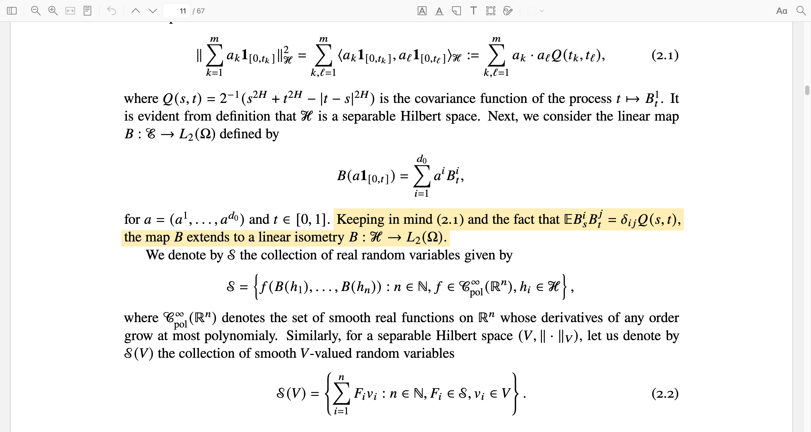
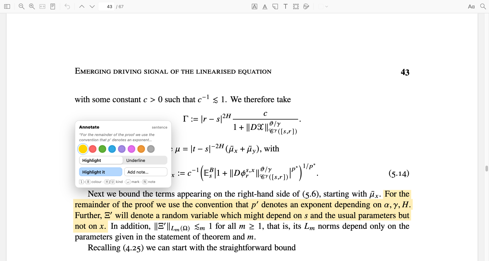
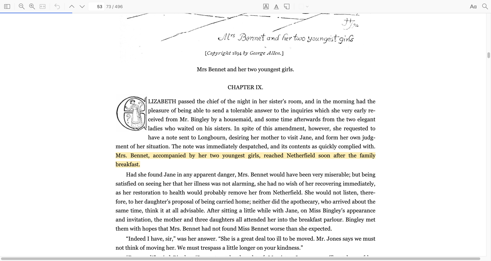

# Sentence Focus

A reading ruler for Zotero that moves **one sentence at a time** instead of one
line at a time. It works in PDFs, EPUBs and saved web pages.



Press `]` to step forward, `[` to step back, or click a sentence to jump to it
(clicking can be set to need `⌘`/`Ctrl`, or to do nothing at all). You can also
step by word, line or paragraph, and `⌘`/`Ctrl`+`C` copies the sentence you are
on when nothing is selected.

Press `Option+H` (`Alt+H`) to keep what you are reading: the sentence under the
ruler — or whatever you have selected — becomes a Zotero highlight or underline.



The panel is made for the keyboard: `1`–`8` pick a colour and mark it, `h` and
`u` choose highlight or underline, `Enter` marks it in the last colour you used,
and `n` marks it and opens Zotero's own popup for a comment and tags.

## Install

1. Download `sentence-focus.xpi` from
   [Releases](https://github.com/ievlevpn/zotero-sentence-focus/releases).
2. In Zotero: **Tools → Add-ons → ⚙ → Install Add-on From File…** and pick the
   file.
3. Open a document and click the **¶** button in the reader's toolbar.

Right-click **¶** for the settings — step size, colour, highlight style,
scrolling, the annotating shortcut — which are also under
**Zotero → Settings → Sentence Focus**. That menu also counts what you have
read in the tab, and can put the count back to zero.

Zotero 7 or later. In Zotero 7 the highlight in books and web pages is drawn as
boxes rather than as coloured text; everything else is the same.

## What makes it different

A sentence rarely fits on one line. In a paper it wraps over four lines, crosses
a column, has a formula in the middle, and starts halfway through a line where
the previous one ended. Highlighting "the current line" cuts all of that apart.
This plugin highlights the sentence as the one thing it is.



It was built for academic reading, so it also knows that:

- **displayed equations** are their own step, not part of the prose around them
  (unless you ask for them to be folded in);
- a **table row** is one thing, read across, not a pile of unrelated cells;
- `Fig. 3`, `et al. [12]`, `Mr.`, `U.S.` and `i.e.` do not end a sentence, and
  neither does the stop in `Comm. Math. Phys. 86`;
- **running heads, page numbers and equation numbers** are not sentences at all;
- a word **hyphenated across a line** is one word.

## How it works

Zotero hands the plugin the characters of a page with their positions and
fonts — for a book, the text of the chapter. From there:

1. **Characters become lines.** Zotero cuts a line wherever two glyphs fail an
   overlap test, so a formula arrives in pieces; the plugin stitches the pieces
   of a line back together, and tells that from a genuine new line by the
   baseline the text sits on.
2. **Lines become columns.** The page is cut down a gutter where there is one,
   and across white space where a table or figure spans both columns, so a
   sentence carries on into the right column instead of into the figure below
   it.
3. **Lines are sorted into prose, formulas, tables and furniture.** Prose is
   what sits on the paragraph's own margins, a line's height apart. Something
   off that flow with a relation in it is a displayed formula; rows of cells
   whose gaps line up are a table; what a caption calls a figure is neither.
4. **Prose becomes sentences.** Every `.`, `!`, `?` and `…` is a candidate, and
   ends a sentence only if a space and something sentence-shaped follow and no
   exception applies — an abbreviation, an initial, a decimal, a citation inside
   brackets, a journal volume.
5. **The unit is painted** as a single wash of colour over the lines it
   occupies — in books, using the browser's own text highlighting, so it follows
   page turns and font-size changes on its own.

The long version, rule by rule, is in [docs/how-it-works.md](docs/how-it-works.md).

It is checked against 25 real papers (828 pages) — maths, physics, machine
learning, a 180-page monograph, and papers written in Word — plus a test suite
that needs no Zotero. Reading a page takes about 5 ms, and is cached.

## Compared with line_focus

Sentence Focus was inspired by
[line_focus](https://github.com/JunyeolYu/line_focus), which moves a band down
the page a line at a time. The difference is what one step is:

| | line_focus | Sentence Focus |
|---|---|---|
| A step | a line | a sentence — or a word, line or paragraph |
| A wrapped sentence | one line of it at a time | all of it, across lines and columns |
| Equations | a band across whatever is there | their own step, or folded into the sentence |
| Tables | line by line | a row at a time |
| Formats | PDF | PDF, EPUB, web snapshot |
| Placing the ruler | keys | keys, or click a sentence |
| Annotating | — | one key turns the sentence into a Zotero highlight |

If you want a plain band that follows lines, line_focus is the simpler tool.
This one is for dense prose, where the sentence rather than the line is the unit
of attention.

## Limits

- A sentence split by a **page break** becomes two steps. Column breaks within a
  page are handled; page breaks are not.
- **Scanned PDFs** depend on their OCR: if the maths comes back as ordinary
  text, equations read as prose.
- The shaped highlight styles (rounded, soft, marker) come out as a flat tint in
  books and web pages, where the browser allows only colour and underlines.
- Figure and diagram labels are read as text, so the ruler can land on them.

## Development

```sh
node test.js        # the analysis on synthetic pages — no Zotero needed
node lint.js        # checks that every function the plugin calls exists
open preview.html   # a bench for the highlight styles
```

`tools/` runs Zotero's own pdf.js offline over real papers, draws what the
plugin makes of a page on top of the rendered page, and diffs a change across
the whole corpus; see [docs/how-it-works.md](docs/how-it-works.md).

When the ruler marks the wrong thing, **Copy page diagnostics** in the reader
menu puts an account of how that page was read on the clipboard — the most
useful thing to attach to a bug report.
